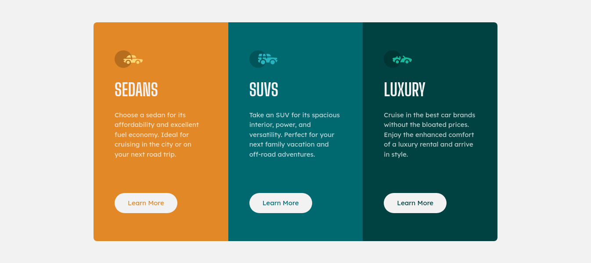

# Frontend Mentor - 3-column preview card component solution

This is a solution to the [3-column preview card component challenge on Frontend Mentor](https://www.frontendmentor.io/challenges/3column-preview-card-component-pH92eAR2-). Frontend Mentor challenges help you improve your coding skills by building realistic projects.

## Table of contents

- [Overview](#overview)
  - [The challenge](#the-challenge)
  - [Screenshot](#screenshot)
  - [Links](#links)
- [My process](#my-process)
  - [Built with](#built-with)
  - [What I learned](#what-i-learned)
  - [Continued development](#continued-development)
  - [Useful resources](#useful-resources)
- [Author](#author)

## Overview

### The challenge

Users should be able to:

- View the optimal layout depending on their device's screen size
- See hover states for interactive elements

### Screenshot



### Links

- Solution URL: [Solution Url](https://github.com/JRS-Developer/3-column-preview-card)
- Live Site URL: [Live Site](https://preview-cards-jrs.netlify.app/)

## My process

### Built with

- Semantic HTML5 markup
- CSS custom properties
- CSS Grid
- Mobile-first workflow

### What I learned

- Make a responsive grid without the need of media queries :grinning:

```css
.card__container {
  display: grid;
  grid-template-columns: repeat(auto-fit, minmax(300px, 1fr));
  grid-auto-flow: dense;
  max-width: 920px;
}
```

### Useful resources

- [Responsive Grid without media queries](https://css-tricks.com/look-ma-no-media-queries-responsive-layouts-using-css-grid/) - This helped me to make a css Grid layout without the need of using media queries, it was really useful

## Author

- Website - [Jose Sanchez](https://jrs-developer.github.io/)
- Frontend Mentor - [@JRS-Developer](https://www.frontendmentor.io/profile/JRS-Developer)
- Linkedin - [@jose-s-developer](https://www.linkedin.com/in/jose-s-developer/)
