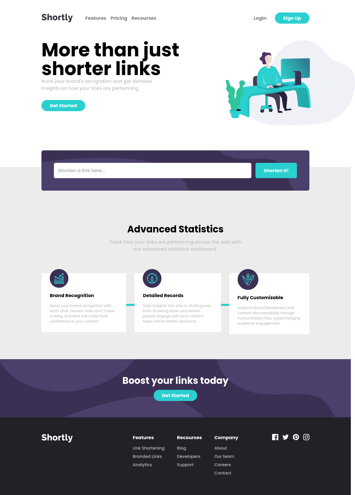

# Frontend Mentor - Job listings with filtering solution

This is a solution to the [Job listings with filtering challenge on Frontend Mentor](https://www.frontendmentor.io/challenges/job-listings-with-filtering-ivstIPCt). Frontend Mentor challenges help you improve your coding skills by building realistic projects.

## Table of contents

- [Overview](#overview)
  - [The challenge](#the-challenge)
  - [Screenshot](#screenshot)
  - [Links](#links)
- [My process](#my-process)
  - [Built with](#built-with)
  - [What I learned](#what-i-learned)
  - [Continued development](#continued-development)
- [Author](#author)

## Overview

### The challenge

Users should be able to:

- View the optimal layout for the site depending on their device's screen size
- See hover states for all interactive elements on the page
- Filter job listings based on the categories

### Screenshot



### Links

- Solution URL: [Solution](https://www.frontendmentor.io/solutions/static-job-listing-with-filtering-of-jobs-kDeQbrAiP)
- Live Site URL: [Live Site](https://github.com/jrS-Developer/static-job-listing/)

## My process

### Built with

- Semantic HTML5 markup
- Flexbox
- Mobile-first workflow
- [React](https://reactjs.org/) - JS library
- [TypeScript](https://www.typescriptlang.org/) - JS but with strong typed
- [TailWindCSS](https://tailwindcss.com/) - CSS FrameWork

### What I learned

In this project I learned a lot using TypeScript and TailWindCSS, in this project I deciced to use TypeScript to obtain the advantages like types and avoid errors with what need a function and have a better organization of the code and the CSS framework TailWindCSS for the styles of the site to avoid to think in names to classes and to have a great design system.

- Reforzing the use of types and interfaces with TypeScript:

```ts
// Showing childrens in TypeScript
const MyComponent = ({ children }: { children: React.ReactNode }) => {
  return <>{children}</>;
};
```

```ts
// Providing the types for the AppContext
export interface AppContextInterface {
  jobItems: JobInterface[];
  filters: string[];
  AddFilterContext?: (title: string | null) => void;
  RemoveFilterContext?: (title: string | null) => void;
  ClearFilterContext?: () => void;
}
```

### Continued development

Learn more development recourses with React like NextJS or GatsbyJS and maybe see a little of React Native to getting better with JavaScript and the creation of front-end Apps

## Author

- Website - [Jose Sanchez - JRS-Developer](https://jrs-developer.github.io/)
- Frontend Mentor - [@JRS-Developer](https://www.frontendmentor.io/profile/JRS-Developer)
- Twitter - [@Josejrsdev](https://twitter.com/Josejrsdev/)
- Linkedin - [@jose-s-developer](https://www.linkedin.com/in/jose-s-developer/)
