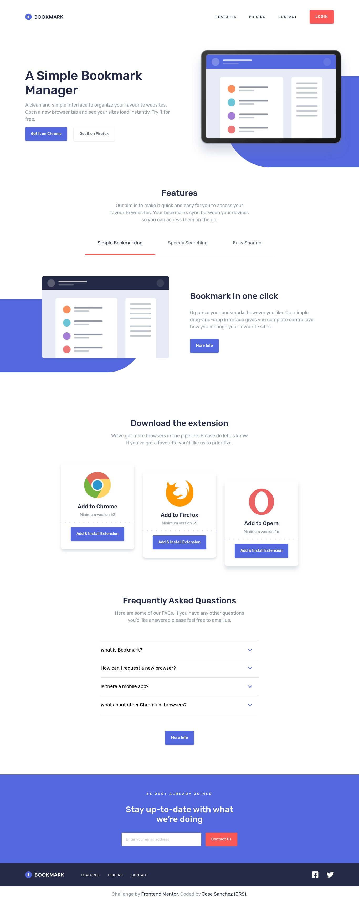

# Frontend Mentor - Bookmark landing page solution

This is a solution to the [Bookmark landing page challenge on Frontend Mentor](https://www.frontendmentor.io/challenges/bookmark-landing-page-5d0b588a9edda32581d29158). Frontend Mentor challenges help you improve your coding skills by building realistic projects.

## Table of contents

- [Overview](#overview)
  - [The challenge](#the-challenge)
  - [Screenshot](#screenshot)
  - [Links](#links)
- [My process](#my-process)
  - [Built with](#built-with)
  - [Continued development](#continued-development)
  - [Useful resources](#useful-resources)
- [Author](#author)

## Overview

### The challenge

Users should be able to:

- View the optimal layout for the site depending on their device's screen size
- See hover states for all interactive elements on the page
- Receive an error message when the newsletter form is submitted if:
  - The input field is empty
  - The email address is not formatted correctly

### Screenshot

### Links

- Solution URL: [Solution URL](https://github.com/JRS-Developer/bookmark-landing-page)
- Live Site URL: [Live site URL](https://bookmark-landing-jrs.netlify.app/)

## My process

### Built with

- Semantic HTML5 markup
- CSS custom properties
- Flexbox
- CSS Grid
- Mobile-first workflow
- Sass

### Useful resources

- [Aria Design Patterns Examples](https://w3c.github.io/aria-practices/examples/) - This helped me to can create the accordion and tabs, it has a lot of components following the ARIA practices.

## Author

- Website - [Jose Sanchez](https://jrs-developer.github.io/)
- Frontend Mentor - [@JRS-Developer](https://www.frontendmentor.io/profile/JRS-Developer)
- Linkedin - [@jose-jrs](https://www.linkedin.com/in/jose-jrs/)
