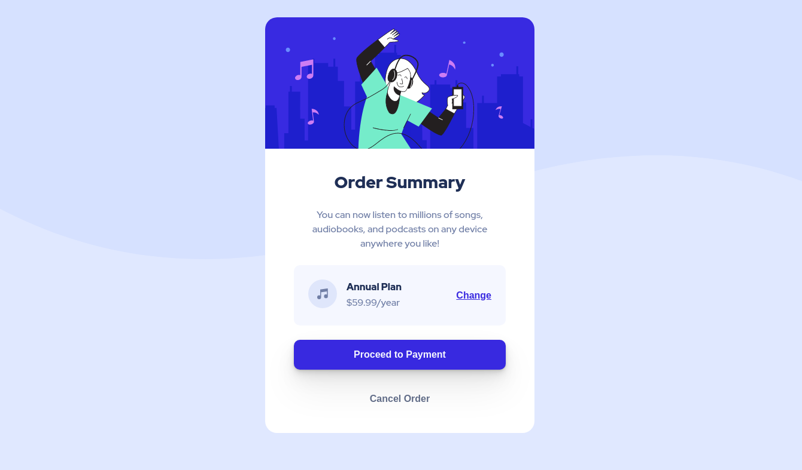

# Frontend Mentor - Order summary card solution

This is a solution to the [Order summary card challenge on Frontend Mentor](https://www.frontendmentor.io/challenges/order-summary-component-QlPmajDUj). Frontend Mentor challenges help you improve your coding skills by building realistic projects.

## Table of contents

- [Overview](#overview)
  - [The challenge](#the-challenge)
  - [Screenshot](#screenshot)
  - [Links](#links)
- [My process](#my-process)
  - [Built with](#built-with)
- [Author](#author)

## Overview

### The challenge

Users should be able to:

- See hover states for interactive elements

### Screenshot

### Links

- Solution URL: [Solution URL](https://github.com/JRS-Developer/order-summary)
- Live Site URL: [Live site URL](https://order-summary-jrs.netlify.app/)

## My process

### Built with

- Semantic HTML5 markup
- CSS custom properties
- Flexbox
- Mobile-first workflow

## Author

- Website - [Jose Sanchez](https://jrs-developer.github.io/)
- Frontend Mentor - [@JRS-Developer](https://www.frontendmentor.io/profile/JRS-Developer)
- Linkedin - [@jose-jrs](https://www.linkedin.com/in/jose-jrs/)
