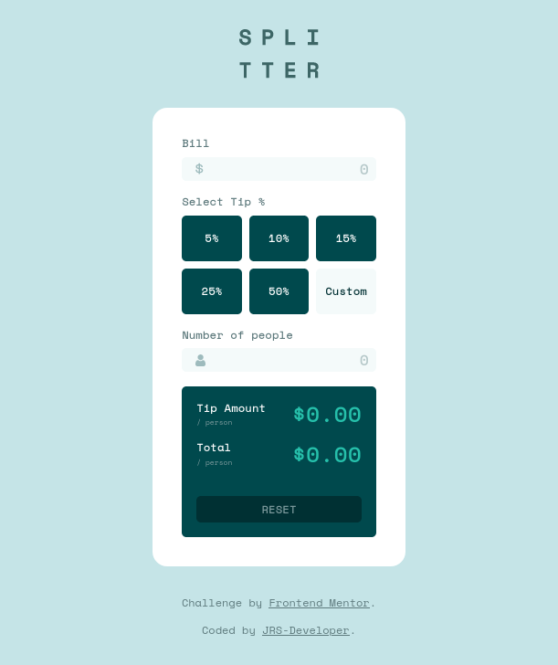

# Frontend Mentor - Tip calculator app solution

This is a solution to the [Tip calculator app challenge on Frontend Mentor](https://www.frontendmentor.io/challenges/tip-calculator-app-ugJNGbJUX). Frontend Mentor challenges help you improve your coding skills by building realistic projects.

## Table of contents

-   [Overview](#overview)
    -   [The challenge](#the-challenge)
    -   [Screenshot](#screenshot)
    -   [Links](#links)
-   [My process](#my-process)
    -   [Built with](#built-with)
    -   [What I learned](#what-i-learned)
    -   [Continued development](#continued-development)
    -   [Useful resources](#useful-resources)
-   [Author](#author)

## Overview

### The challenge

Users should be able to:

-   View the optimal layout for the app depending on their device's screen size
-   See hover states for all interactive elements on the page
-   Calculate the correct tip and total cost of the bill per person

### Screenshot




### Links

-   Solution URL: [Add solution URL here](https://www.frontendmentor.io/solutions/tip-calculator-app-made-with-reactjs-scss-responsive-design-MiHP2j0Y_)
-   Live Site URL: [Add live site URL here](https://tip-calculator-app-jrs.netlify.app/)

## My process

### Built with

-   Semantic HTML5 markup
-   CSS custom properties
-   Flexbox
-   CSS Grid
-   Mobile-first workflow
-   [React](https://reactjs.org/) - JS library
-   [SCSS - SASS](https://sass-lang.com/) - For styles

### What I learned

The mayor thing I learnt is to personalize better the inputs elements, add an icon to an input.

```css
.input-container--icon {
    position: relative;
}

.input-container--icon > img {
    left: 15px;
    position: absolute;
    top: 12px;
}
```

Remove the spin button of the number input

```css
input::-webkit-outer-spin-button,
input::-webkit-inner-spin-button {
    appearance: none;
    margin: 0;
}

input[type="number"] {
    appearance: textfield;
}
```

### Continued development

Making this project I saw that I have to work hard on doing better the use of the global context to maintain better the context of the app, because at some moments I had problems with that.

## Author

-   Website - [Jose Sanchez - JRS-Dev](https://jrs-developer.github.io/)
-   Frontend Mentor - [@JRS-Developer](https://www.frontendmentor.io/profile/JRS-Developer)
-   Twitter - [@Josejrsdev](https://www.twitter.com/Josejrsdev)
